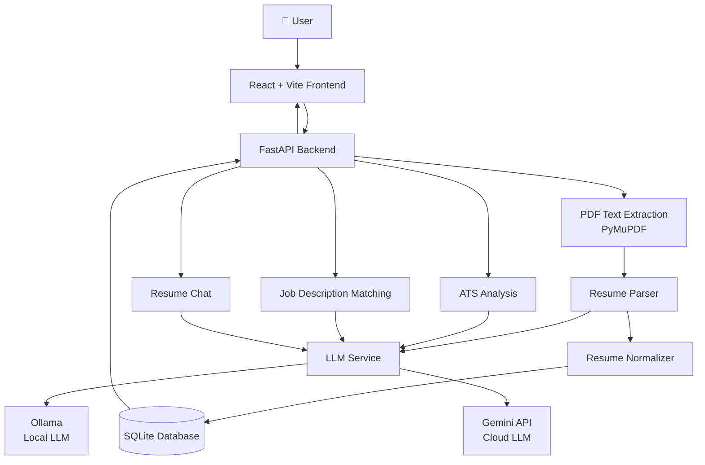

## 🏗️ System Architecture

```mermaid
flowchart TD

    User["👤 User"]

    Frontend["React + Vite Frontend"]

    API["FastAPI Backend"]

    PDF["PDF Text Extraction<br/>PyMuPDF"]

    Parser["Resume Parser"]

    LLM["LLM Service"]

    Ollama["Ollama<br/>Local LLM"]

    Gemini["Gemini API<br/>Cloud LLM"]

    Normalizer["Resume Normalizer"]

    Database[("SQLite Database")]

    ATS["ATS Analysis"]

    JD["Job Description Matching"]

    Chat["Resume Chat"]

    User --> Frontend

    Frontend --> API

    API --> PDF

    PDF --> Parser

    Parser --> LLM

    LLM --> Ollama
    LLM --> Gemini

    Parser --> Normalizer

    Normalizer --> Database

    Database --> API

    API --> ATS
    API --> JD
    API --> Chat

    ATS --> LLM
    JD --> LLM
    Chat --> LLM

    API --> Frontend
```
