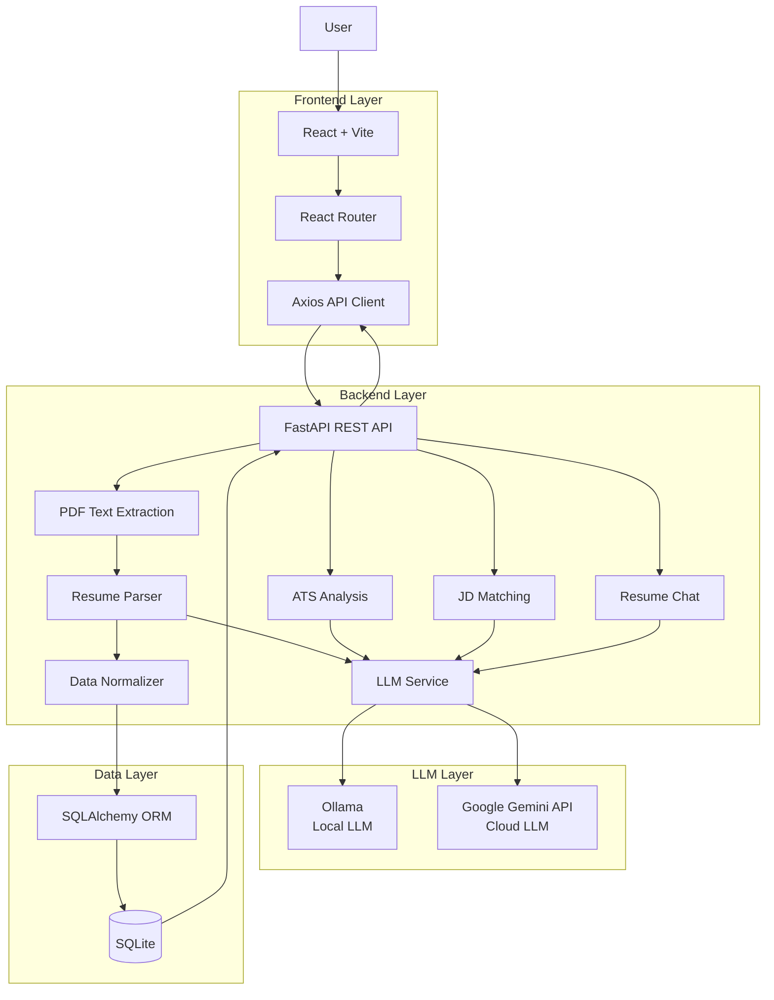
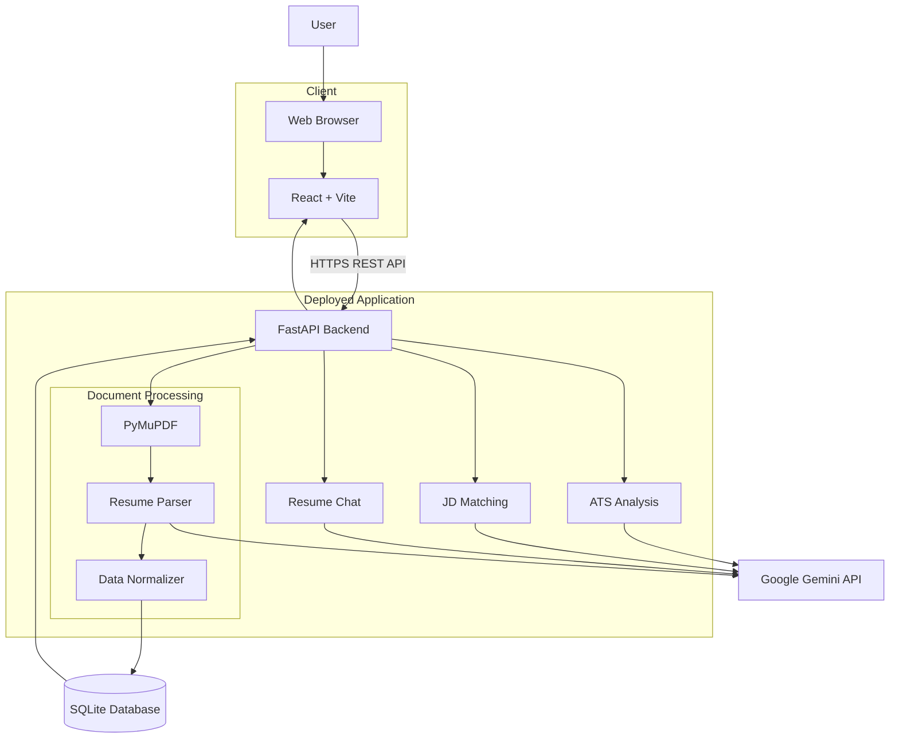
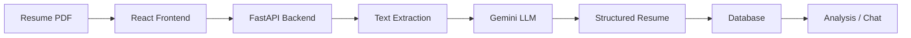
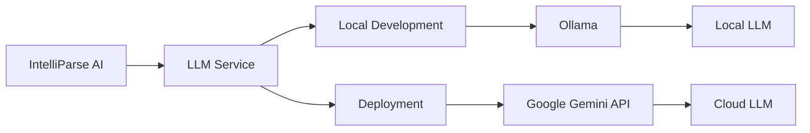

# IntelliParse AI

<p align="center">
  <strong>LLM-Powered Document Intelligence & Resume Automation Platform</strong>
</p>

<p align="center">
  Transform unstructured resumes into structured, searchable and actionable candidate intelligence.
</p>

<p align="center">


</p>

<p align="center">


</p>

---

## Overview

**IntelliParse AI** is a full-stack **LLM-powered document intelligence platform** designed to automate resume processing and analysis.

The application takes an unstructured PDF resume, extracts its content, uses a Large Language Model to understand and structure the information, stores the resulting data, and provides an interactive interface for searching, analyzing, and querying candidate information.

IntelliParse supports:

- **Ollama** for local LLM inference during development
- **Google Gemini API** for the deployed/cloud environment

The project combines **document automation, LLM integration, backend API development, database management, and modern frontend development** into a single end-to-end application.

---

# Features

## Resume Document Processing

- Upload PDF resumes
- Extract resume text using PyMuPDF
- Process unstructured resume content with an LLM
- Convert resume information into structured JSON
- Normalize extracted data
- Store structured candidate information in SQLite

---

## Resume Library

Manage processed resumes through a centralized interface.

- View processed resumes
- Search resumes by skills
- Open individual candidate profiles
- Update resume information
- Delete stored resumes
- Maintain structured candidate records

---

## LLM-Powered Resume Chat

Interact with resume information using natural language.

Example queries:

```text
Summarize this candidate.

What are the candidate's technical skills?

Does this candidate have experience with FastAPI?

List the candidate's projects.

What programming languages does this candidate know?

What are the candidate's strongest technical areas?
```

The chatbot can also use job-description context to provide more relevant candidate analysis.

---

## 📊 ATS Analysis

IntelliParse provides ATS-oriented resume analysis to help identify areas that may affect resume compatibility.

The analysis can be used to understand:

- Resume quality
- Skill coverage
- Potential ATS issues
- Areas that can be improved

---

## Job Description Matching

Compare a candidate's resume against a target job description.

The system can identify:

- Matching skills
- Missing skills
- Relevant experience
- Areas of alignment
- Potential skill gaps

Example:

```text
Resume ↔ Job Description

Match: 82%

Matched Skills
✓ Python
✓ FastAPI
✓ SQL
✓ REST APIs

Missing Skills
✗ Docker
✗ AWS

Potential Gap
Cloud deployment experience
```

---

# System Architecture


---

# ☁️ Deployed Architecture

The deployed application uses **Google Gemini API** for LLM inference instead of the locally hosted Ollama model.



---

# Production Request Flow



---

# Local vs Deployed LLM Architecture

IntelliParse uses a provider-independent LLM service layer.



| Environment | LLM Provider | Purpose |
|---|---|---|
| Local Development | Ollama | Local inference without external API dependency |
| Deployment | Google Gemini API | Cloud-based LLM inference |

The application uses the same core processing pipeline in both environments. Only the LLM provider changes based on the environment configuration.

---

# Tech Stack

## Frontend

| Technology | Purpose |
|---|---|
| React | User interface |
| Vite | Frontend build tool |
| React Router | Client-side routing |
| Tailwind CSS | Styling |
| Framer Motion | UI animations |
| Axios | API communication |

## Backend

| Technology | Purpose |
|---|---|
| Python | Backend programming language |
| FastAPI | REST API framework |
| Uvicorn | ASGI server |
| Pydantic | Data validation |
| SQLAlchemy | ORM |
| python-dotenv | Environment configuration |

## AI & Document Processing

| Technology | Purpose |
|---|---|
| Google Gemini | Cloud LLM |
| Ollama | Local LLM inference |
| PyMuPDF | PDF text extraction |
| Prompt Engineering | Structured information extraction |


# Getting Started

## Prerequisites

Make sure you have:

- Python 3.x
- Node.js 20+
- npm
- Ollama for local LLM inference

For Gemini-based deployment:

- Google Gemini API key

---

# Backend Setup

Clone the repository:

```bash
git clone https://github.com/pavxxx/IntelliParse-AI.git
cd IntelliParse-AI
```

Navigate to the backend:

```bash
cd backend
```

Create a virtual environment:

```bash
python -m venv .venv
```

### Windows

```bash
.venv\Scripts\activate
```

### macOS / Linux

```bash
source .venv/bin/activate
```

Install dependencies:

```bash
pip install -r requirements.txt
```

---

# LLM Configuration

## Local Development — Ollama

Install Ollama and download the model you want to use.

Example:

```bash
ollama pull llama3.2
```

Create a `.env` file inside `backend/`:

```env
LLM_PROVIDER=ollama
OLLAMA_BASE_URL=http://localhost:11434
OLLAMA_MODEL=llama3.2
```

Make sure Ollama is running before starting the backend.

---

## Deployment — Gemini API

For the deployed version, configure Gemini:

```env
LLM_PROVIDER=gemini
GEMINI_API_KEY=your_api_key_here
GEMINI_MODEL=your_model_name
```

> **Never commit your `.env` file or API keys to GitHub.**

---

#  Run the Backend

From the `backend/` directory:

```bash
uvicorn app:app --reload
```

The API will be available at:

```text
http://localhost:8000
```

FastAPI documentation:

```text
http://localhost:8000/docs
```

---

# Frontend Setup

Open a new terminal:

```bash
cd frontend
```

Install dependencies:

```bash
npm install
```

Start the development server:

```bash
npm run dev
```

The frontend will normally be available at:

```text
http://localhost:5173
```

---

# API Overview

The frontend communicates with the backend through REST APIs.

| Method | Endpoint | Description |
|---|---|---|
| `GET` | `/` | API health/root endpoint |
| `POST` | `/upload-resume` | Upload and process a resume |
| `GET` | `/resumes` | Retrieve stored resumes |
| `GET` | `/resume/{id}` | Retrieve a specific resume |
| `DELETE` | `/resume/{id}` | Delete a stored resume |
| `GET` | `/search` | Search resumes |
| `GET` | `/ats/{id}` | Generate ATS analysis |
| `POST` | `/jd-match/{id}` | Match resume with job description |
| `POST` | `/chat` | Ask questions about a resume |

> Endpoint names should be kept synchronized with the current backend implementation.

---

# How the LLM Is Used

The LLM is not used as a standalone chatbot only.

It participates in multiple stages of the application:

```text
                    Resume
                      │
                      ▼
              Text Extraction
                      │
                      ▼
                LLM Parsing
                      │
                      ▼
             Structured Resume
                      │
          ┌───────────┼───────────┐
          ▼           ▼           ▼
       ATS       JD Matching    Chat
          │           │           │
          └───────────┼───────────┘
                      ▼
               Candidate Insights
```

This allows the same structured candidate data to support different workflows.

---

# Use Cases

## Recruiters

IntelliParse can help recruiters:

- Quickly understand candidate profiles
- Search candidates by skills
- Generate candidate summaries
- Ask natural-language questions about resumes
- Compare candidate profiles with job requirements
- Identify relevant and missing skills

## Applicants

The platform can assist applicants with:

- Resume understanding
- ATS-oriented analysis
- Job-description matching
- Skill-gap identification
- Resume improvement workflows

---


